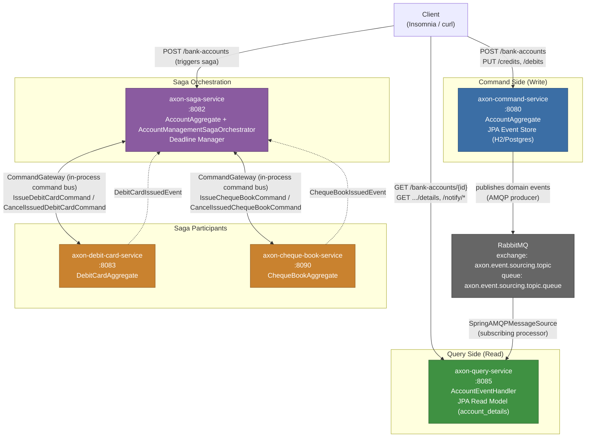
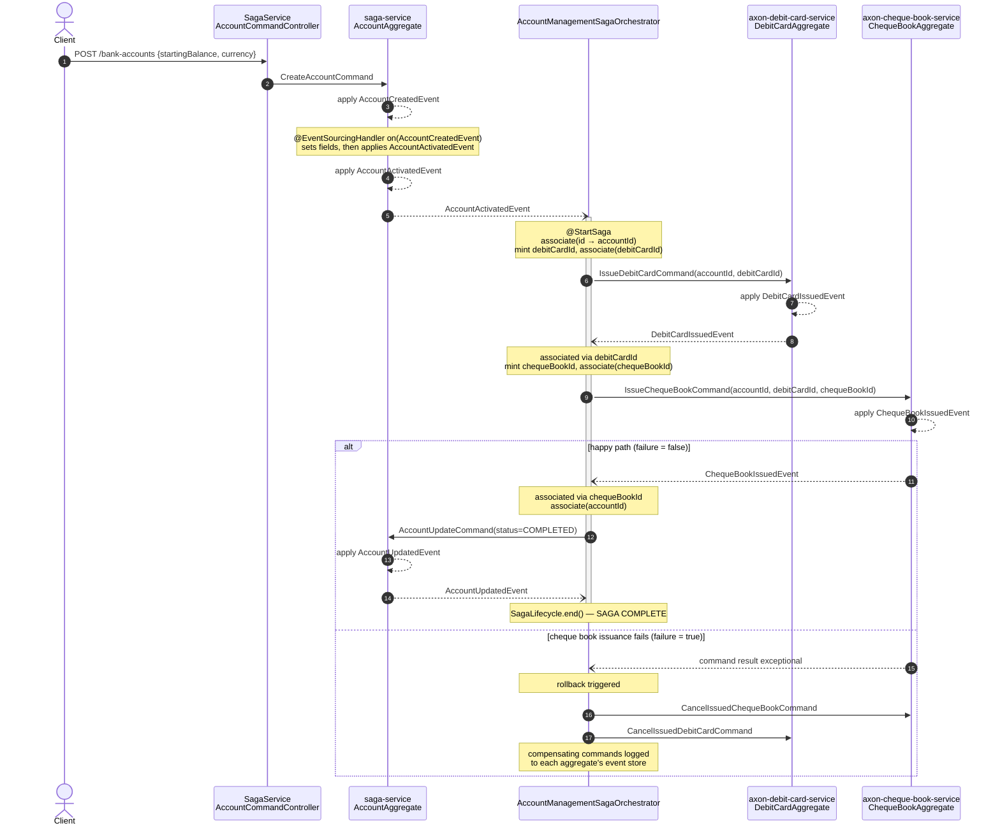

# Learning Axon — CQRS + Event Sourcing + Saga


A multi-module Maven project demonstrating **CQRS** (Command Query Responsibility Segregation), **Event Sourcing**, and the **Saga pattern** using Axon Framework 4.13.1, Spring Boot 4.1.0, and Java 25. The domain is deliberately small — opening a bank account, crediting/debiting money, and an account-opening workflow that issues a debit card and a cheque book — so that the *architecture* stays the star of the show rather than the business logic.

This document is a deep dive into **how** and **why** the code is built the way it is: what CQRS and Event Sourcing actually mean, how Axon implements an Aggregate, how the read side is projected, and how a Saga coordinates a multi-step, multi-service business transaction with compensation. Every code walk-through below points at real classes in this repository — nothing here is aspirational.

---

## Table of Contents

1. 💡 [Why CQRS and Event Sourcing?](#why-cqrs-and-event-sourcing)
2. 🏗️ [Component Architecture](#component-architecture)
3. 🔹 [The Command Side — Aggregates and Event Sourcing](#the-command-side--aggregates-and-event-sourcing)
4. 🤖 [The Query Side — Projections and Read Models](#the-query-side--projections-and-read-models)
5. 🔀 [The Saga — Orchestrating a Multi-Step Business Process](#the-saga--orchestrating-a-multi-step-business-process)
6. 🌐 [axon-shared — The Contract Between Services](#axon-shared--the-contract-between-services)
7. 🏗️ [Modules](#modules)
8. 🏗️ [GoF Design Patterns](#gof-design-patterns)
9. 🧰 [Tech Stack](#tech-stack)
10. 🚀 [Quick Start](#quick-start)
11. 📚 [API Reference](#api-reference-command-service--port-8080)
12. 💡 [Axon Concepts Demonstrated](#axon-concepts-demonstrated)
13. 📈 [Monitoring](#monitoring)
14. ✅ [Best Practices Applied](#best-practices-applied)
15. 🧪 [Testing Saga Rollback](#testing-saga-rollback)

---

<a id="why-cqrs-and-event-sourcing"></a>
## 1. 💡 Why CQRS and Event Sourcing?

### CQRS: splitting reads from writes

In a conventional CRUD service, a single model (one JPA entity, one table) is used both to *decide* whether a change is valid and to *answer questions* about the current state. **Command Query Responsibility Segregation** rejects that assumption: it says the model optimized for validating and applying a change (the **write model**) is rarely the model that is convenient for querying (the **read model**), so split them into two independently deployable, independently scalable code paths:

<ul>

- A **command side** that accepts *intents to change state* (`CreateAccountCommand`, `CreditMoneyCommand`, `DebitMoneyCommand`, …), validates them against business rules, and — if valid — records that the change happened.
- A **query side** that only ever answers "what does the world look like right now / historically", built from a model shaped entirely for reading (flat tables, denormalized views, whatever the UI needs).

</ul>

In this repository that split is literally two Maven modules and two Spring Boot processes: `axon-command-service` (port 8080) owns `AccountAggregate` and the event store; `axon-query-service` (port 8085) owns `AccountEntity` and a plain `account_details` JPA table. They do not share a database. They communicate only through **events** carried over RabbitMQ (see [Component Architecture](#component-architecture)).

### Event Sourcing: the log *is* the truth

The command side does not persist "the current balance of account X" as a mutable row. Instead, every state transition is captured as an immutable **domain event** — `AccountCreatedEvent`, `MoneyCreditedEvent`, `MoneyDebitedEvent`, `AccountActivatedEvent`, `AccountHeldEvent` — and Axon appends these events, in order, to an **event store** (an append-only log, backed here by a JPA table on H2/PostgreSQL). The *current* state of an `AccountAggregate` is never stored directly; it is **derived** by replaying every event for that aggregate ID, in order, from the beginning of time (or from the last snapshot — see below).

This gives CQRS a natural implementation for the write side: the aggregate's job is exactly "given the events that happened so far (the current state), and a new command, decide whether to accept it, and if so, what new event(s) does it produce?" That question-answering shape is precisely what an Axon `@Aggregate` class implements.

Why pair the two patterns? Event Sourcing gives CQRS's write side a complete, replayable audit trail (a legal/regulatory plus for banking-flavored domains like this one) and gives the read side its data-in: the query service does not poll the write-side database — it reacts to the same events the aggregate produced, over the event bus, and folds them into whatever shape is convenient to query. Neither side needs to know how the other stores or renders data; the event stream is the only contract, and `axon-shared` defines that contract's vocabulary (see [axon-shared](#axon-shared--the-contract-between-services)).

---

<a id="component-architecture"></a>
## 2. 🏗️ Component Architecture

Five Spring Boot services plus one shared library, wired through Axon's command/query gateways in-process and through RabbitMQ across process boundaries:



Two things are worth noting about the topology:

<ul>

- **`axon-command-service` and `axon-query-service` never talk directly.** They are decoupled entirely through AMQP: the command service's `axon.amqp.exchange=axon.event.sourcing.topic` publishes every applied event; the query service's `AmqpEventListener` bean wires a `SpringAMQPMessageSource` to the same exchange's queue (`axon.event.sourcing.topic.queue`), and `AxonQueryConfig` forces `usingSubscribingEventProcessors()` so those AMQP messages are handled synchronously as they arrive rather than through Axon's own tracking-token mechanism (which is reserved for the command service's local `TrackingEventProcessor`, used for replay — see [The Command Side](#the-command-side--aggregates-and-event-sourcing)).
- **`axon-saga-service`, `axon-debit-card-service`, and `axon-cheque-book-service` communicate over Axon's in-process command bus**, not AMQP — in this demo they are separate Maven modules/services conceptually, but the saga dispatches `IssueDebitCardCommand`/`IssueChequeBookCommand` through the same `CommandGateway` abstraction used everywhere else in the codebase. (In a fully distributed deployment, this is exactly the seam where an `axon-server-connector` or another message-bus binding would be dropped in without touching any handler code — command handler routing is external to the aggregate.)

</ul>

---

<a id="the-command-side--aggregates-and-event-sourcing"></a>
## 3. 🔹 The Command Side — Aggregates and Event Sourcing

### What an Axon Aggregate is

An **Aggregate** is Axon's unit of consistency: a cluster of state that is loaded, mutated, and persisted atomically, identified by a single `@AggregateIdentifier`. In Domain-Driven Design terms it's the aggregate root. Two annotations do all the work:

<ul>

- `@CommandHandler` — a method (or constructor) that receives a `Command` message, validates it against the aggregate's *current* in-memory state, and — if the command is valid — calls `AggregateLifecycle.apply(event)` to record that something happened. **It never mutates fields directly.**
- `@EventSourcingHandler` — a method that receives an event (either one just applied, or one being replayed from the event store) and is the *only* place allowed to mutate the aggregate's fields.

</ul>

This separation is the whole trick of event sourcing: applying an event and event-sourcing that same event are two different method invocations. The command handler decides *whether* something should happen; the event-sourcing handler decides *what that means for in-memory state*. Because state mutation only ever happens inside `@EventSourcingHandler` methods, **replaying the exact same sequence of past events reconstructs the exact same aggregate state** — which is what happens every time Axon loads an aggregate from the event store to handle a new command.

### `AccountAggregate` in `axon-command-service`

`axon-command-service/src/main/java/com/learning/axon/command/aggregate/AccountAggregate.java` is the primary write model in this repository. Walking through it:

```java
@CommandHandler
public AccountAggregate(CreateAccountCommand cmd) {
    AggregateLifecycle.apply(
        new AccountCreatedEvent(cmd.getId(), cmd.getAccountBalance(), cmd.getCurrency(), Status.CREATED));
}
```

The constructor *is* the command handler for creation — Axon instantiates the aggregate by calling this constructor when a `CreateAccountCommand` arrives for an ID that doesn't exist yet. It applies exactly one event; it does not set any fields itself.

```java
@EventSourcingHandler
protected void on(AccountCreatedEvent event) {
    this.id = event.getId();
    this.accountBalance = event.getAccountBalance();
    this.currency = event.getCurrency();
    this.status = Status.CREATED;

    if (accountBalance > 100) {
        AggregateLifecycle.apply(new AccountActivatedEvent(this.id, accountBalance, currency, Status.ACTIVATED));
    }
}
```

This is where the fields actually get set — and notice the business rule living here rather than in the command handler: **an account only becomes `ACTIVATED` if the opening balance exceeds 100**. Because this check runs inside the event-sourcing handler, it fires identically whether the event was just applied live or is being replayed from storage — an important property, since the whole point of the pattern is that "apply now" and "replay later" must produce the same result. This is confirmed directly by the unit tests: `AccountAggregateTest` (`axon-command-service/src/test/java/.../AccountAggregateTest.java`) asserts *"should publish AccountCreatedEvent and AccountActivatedEvent when balance > 100"* and *"should publish only AccountCreatedEvent when balance <= 100"* — an aggregate can apply a **second** event from inside an event-sourcing handler that reacted to the first, chaining state transitions purely from event data.

Two more business rules follow the same pattern, this time in the credit/debit path:

```java
@EventSourcingHandler
protected void on(MoneyCreditedEvent event) {
    if (this.accountBalance < 0 && (this.accountBalance + event.getCreditAmount()) >= 0) {
        AggregateLifecycle.apply(new AccountActivatedEvent(this.id, Status.ACTIVATED));
    }
    this.accountBalance += event.getCreditAmount();
}

@EventSourcingHandler
protected void on(MoneyDebitedEvent event) {
    if (this.accountBalance >= 0 && (this.accountBalance - event.getDebitAmount()) < 0) {
        AggregateLifecycle.apply(new AccountHeldEvent(this.id, Status.HOLD));
    }
    this.accountBalance -= event.getDebitAmount();
}
```

A debit that pushes the balance negative triggers an automatic `AccountHeldEvent` (status → `HOLD`); a credit that brings a negative balance back to zero or above automatically re-`ACTIVATED`s the account. `AccountAggregateTest` verifies both directions: *"should publish MoneyDebitedEvent and AccountHeldEvent when balance goes negative"* and *"should reactivate account when credit brings negative balance to zero or above"*. The command handlers for `CreditMoneyCommand`/`DebitMoneyCommand` themselves are almost trivially thin — `AggregateLifecycle.apply(new MoneyCreditedEvent(...))` — because all the interesting decision logic (should this trigger a status change?) is expressed as a *consequence of applying an event*, not as a pre-condition on the command.

### Snapshots — event sourcing's practical caveat

Replaying *every* event since account creation, every single time a command arrives, does not scale once an aggregate has thousands of events. Axon's answer is a **snapshot**: a serialized copy of the aggregate's fields taken every *N* events, so that loading only needs to replay the snapshot plus events since it, not the entire history. `AxonSnapshotConfig` (`axon-command-service/.../config/AxonSnapshotConfig.java`) wires this up explicitly:

```java
@Bean
public EventSourcingRepository<AccountAggregate> accountAggregateRepository(
        Snapshotter snapshotter, ParameterResolverFactory parameterResolverFactory) {
    return EventSourcingRepository.builder(AccountAggregate.class)
            .aggregateFactory(accountAggregateFactory())
            .eventStore(eventStore)
            .snapshotTriggerDefinition(new EventCountSnapshotTriggerDefinition(snapshotter, snapshotThreshold))
            .cache(eventCache())
            .build();
}
```

`snapshotThreshold` defaults to `3` (`axon.snapshot.threshold.limit`) — after every 3rd event on a given `AccountAggregate` instance, Axon serializes its current state as a snapshot. The `SpringAggregateSnapshotter` does this asynchronously on a dedicated thread pool (`snapshotExecutor`, 5–10 threads) so command handling latency isn't blocked by snapshot serialization. `SpringPrototypeAggregateFactory` is the Factory Method that knows how to instantiate a *fresh* `AccountAggregate` (as a Spring prototype-scoped bean) before either a snapshot or event replay is folded into it — this is also why the class is annotated `@Aggregate(repository = "accountAggregateRepository")`: it points Axon at this custom-configured repository bean instead of the framework's auto-configured default.

### Replay and the Tracking Event Processor

`AccountAggregate` is annotated `@ProcessingGroup("account_tep_group")`, which puts its `@EventSourcingHandler` invocations (when Axon replays for other purposes, e.g. rebuilding) under a named **Tracking Event Processor** — a processor that tracks its own position (a token) in the event stream and can be paused, reset, and restarted independently of the rest of the application. `AccountCommandController` exposes this directly:

```java
@PostMapping("/replay")
public ResponseEntity<String> replay() {
    eventProcessingConfiguration
            .eventProcessorByProcessingGroup("account_tep_group", TrackingEventProcessor.class)
            .ifPresent(tep -> { tep.shutDown(); tep.resetTokens(); tep.start(); });
    return ResponseEntity.ok("Replay triggered");
}
```

Calling `POST /bank-accounts/replay` shuts the processor down, resets its tracking token to the beginning, and restarts it — forcing every event in the store to be re-delivered to `@EventSourcingHandler`/`@ResetHandler` methods in that processing group. `AccountAggregate.onReset()` (annotated `@ResetHandler`) is the hook fired immediately before replay starts, used here just to log intent, but it's the place any in-memory/derived state would be cleared before Axon re-folds history into it. This is a genuinely different mechanism from the query side's AMQP-driven `usingSubscribingEventProcessors()` (see next section) — replay/reset semantics are a Tracking Event Processor feature specifically.

### The saga-side `AccountAggregate` is a different, simpler aggregate

`axon-saga-service` has its own `AccountAggregate` (`axon-saga-service/src/main/java/com/learning/axon/saga/aggregate/AccountAggregate.java`) — a deliberately separate class from the command-service one, scoped to the saga's own bounded context. It creates an account and **always** activates it (no balance threshold):

```java
@EventSourcingHandler
protected void on(AccountCreatedEvent event) {
    this.accountId = event.getId();
    ...
    AggregateLifecycle.apply(new AccountActivatedEvent(event.getId(), event.getAccountBalance(), event.getCurrency(), Status.ACTIVATED));
}
```

`AccountActivatedEvent` is exactly the event `AccountManagementSagaOrchestrator` listens for to kick off the saga (see next section). This aggregate also handles `AccountUpdateCommand` (applied by the saga on successful completion, moving status to `COMPLETED`) and `AccountInactiveCommand`, which demonstrates Axon's **Deadline Manager**:

```java
@CommandHandler
public void on(AccountInactiveCommand cmd, DeadlineManager deadlineManager) {
    String deadlineId = deadlineManager.schedule(Duration.ofSeconds(60), HOLD_DEADLINE, cmd.getAccountId());
    AggregateLifecycle.apply(new AccountInactiveEvent(cmd.getAccountId(), Status.INACTIVE),
            MetaData.with(HOLD_DEADLINE, deadlineId));
}

@DeadlineHandler(deadlineName = HOLD_DEADLINE)
public void onHoldDeadline(String accountId) {
    log.info("Deadline fired for account [{}] — apply any expiry logic here", accountId);
}
```

`DeadlineManagerConfig` wires a `SimpleDeadlineManager` (in-memory scheduling, not durable across restarts — a `JpaDeadlineManager` would be swapped in for production durability). This is Axon's mechanism for *time-based* compensating/follow-up logic — schedule a fact ("mark this account inactive if nothing else happens within 60 seconds") to be delivered back to the aggregate later, without an external scheduler.

### Participant aggregates: `DebitCardAggregate` and `ChequeBookAggregate`

Both are small, focused aggregates that exist purely to be commanded by the saga and to publish a single completion event:

<ul>

- `DebitCardAggregate` (`axon-debit-card-service`) — its constructor handles `IssueDebitCardCommand` and applies `DebitCardIssuedEvent`; a second constructor handles `CancelIssuedDebitCardCommand`, the compensating action for saga rollback. Verified by `DebitCardAggregateTest`: *"should publish DebitCardIssuedEvent when IssueDebitCardCommand is received"*.
- `ChequeBookAggregate` (`axon-cheque-book-service`) — same shape, but carries a `failure` boolean field used purely to demonstrate saga rollback on demand:

</ul>

```java
@EventSourcingHandler
protected void on(ChequeBookIssuedEvent event) {
    this.accountId = event.getAccountId();
    ...
    this.status = Status.CHEQUE_BOOK_ISSUED;
    if (failure) {
        throw new CancelIssuedChequeBookException("Simulated cheque book failure — triggering saga rollback");
    }
}
```

Setting `failure = true` and restarting the service causes the event-sourcing handler itself to throw *after* the event would otherwise have been applied, which is enough to make the command fail from the saga's perspective and trigger the compensating chain described in [The Saga](#the-saga--orchestrating-a-multi-step-business-process). `ChequeBookAggregateTest` covers the happy path: *"should publish ChequeBookIssuedEvent when IssueChequeBookCommand is received"*.

---

<a id="the-query-side--projections-and-read-models"></a>
## 4. 🤖 The Query Side — Projections and Read Models

`axon-query-service` never touches `AccountAggregate` and has no event store of its own. Its entire job is to listen to the same domain events the command side publishes and fold them into a plain JPA table (`account_details`, mapped by `AccountEntity`) that is convenient to query — the textbook definition of a CQRS **projection**.

### Getting events across the process boundary: AMQP

The command service publishes every applied event to a RabbitMQ topic exchange (`axon.event.sourcing.topic`, configured in `axon-command-service/src/main/resources/application.yml`). The query service's `AmqpEventListener` bean wires Axon's own `SpringAMQPMessageSource` to a `@RabbitListener` on the corresponding queue (`axon.event.sourcing.topic.queue`):

```java
@Bean
public SpringAMQPMessageSource accountMessageSource(AMQPMessageConverter messageConverter) {
    return new SpringAMQPMessageSource(messageConverter) {
        @Override
        @RabbitListener(queues = "${axon.amqp.queue:axon.event.sourcing.topic.queue}")
        public void onMessage(Message message, Channel channel) {
            log.info("AMQP event received: [{}]", message);
            super.onMessage(message, channel);
        }
    };
}
```

`AxonQueryConfig` then forces this message source to be processed by a **subscribing** event processor rather than Axon's default tracking processor:

```java
@Autowired
public void configure(EventProcessingConfigurer configurer) {
    configurer.usingSubscribingEventProcessors();
}
```

The distinction matters: a *subscribing* processor handles a message synchronously, on the thread that delivered it (here, the RabbitMQ listener container thread) — there's no independent tracking token to manage because the queue itself (with its own ack/redelivery semantics) is the position-tracking mechanism. This is the correct choice when events are arriving from an external broker rather than being pulled from Axon's own event store.

### `AccountEventHandler` — the projection itself

`axon-query-service/src/main/java/com/learning/axon/query/handler/AccountEventHandler.java`, annotated `@ProcessingGroup("amqpEvents")` to bind it to the AMQP message source above, is where events become rows:

```java
@EventHandler
public void on(AccountCreatedEvent event) {
    AccountEntity entity = accountRepository.findById(event.getId())
            .orElse(AccountEntity.builder().id(event.getId()).build());
    entity.setAccountBalance(event.getAccountBalance());
    entity.setCurrency(event.getCurrency());
    entity.setStatus(event.getStatus());
    accountRepository.save(entity);
}
```

`AccountEventHandlerTest` confirms this behavior directly: *"should create account entity on AccountCreatedEvent"*. Handlers for `AccountActivatedEvent`, `AccountHeldEvent`, `MoneyCreditedEvent`, and `MoneyDebitedEvent` follow the same read-modify-write shape, each keeping the `account_details` row in sync with one more domain fact. `@ResetHandler onReset()` truncates the whole projection table — the read-side equivalent of the command side's replay: if the query service's table is ever suspect, wipe it and let a fresh AMQP replay of prior events (or a targeted command-side replay) repopulate it from scratch, since the events — not the projection — are the source of truth.

### Real-time updates: subscription queries

`MoneyCreditedEvent`'s handler does one more thing beyond saving the entity:

```java
queryUpdateEmitter.emit(
        AccountDetailsQuery.class,
        query -> query.id().equals(event.getId()),
        entity);
```

This is Axon's **subscription query** mechanism: `AccountQueryController.subscribeToCredits()` exposes `GET /bank-accounts/notify/credit/{accountId}` as a Server-Sent-Events stream (`Flux<AccountEntity>`), backed by `queryGateway.subscriptionQuery(...)`. A client holding that connection open receives a push the instant `AccountEventHandler` processes the next `MoneyCreditedEvent` for that account — no polling. This is the Observer pattern surfacing at the HTTP layer: the query-side event handler *is* the publisher, and any number of open SSE connections are subscribers, matched by the `query -> query.id().equals(event.getId())` predicate.

### Point-to-point and scatter-gather queries

Two more query shapes are demonstrated side-by-side in `AccountQueryController` / `AccountQueryServiceImpl`:

<ul>

- **Point-to-point**: `GET /bank-accounts/{accountId}/details` → `queryGateway.query(new AccountQuery(accountId), ...)` → routed to exactly one `@QueryHandler` (`AccountQueryServiceImpl.getAccountDetails`). Ordinary request/response.
- **Scatter-gather**: `GET /bank-accounts/scatter/{accountId}` → `queryBus.scatterGather(query, 10, TimeUnit.SECONDS)` broadcasts to *every* `@QueryHandler(queryName = "scatter-gather")` registered (there are two here — one in `AccountEventHandler`, one in `AccountQueryServiceImpl` — each answering independently) and collects all responses within a timeout window. It's a fan-out/fan-in query, useful when multiple read models could answer the same question and you want to compare or merge results.

</ul>

A fourth path, `GET /bank-accounts/{accountId}`, bypasses Axon's query bus entirely and calls the JPA repository directly — included deliberately to contrast "ask through the CQRS query infrastructure" against "just read the database", since both are legitimate depending on whether you need query-bus features (routing, subscriptions, interceptors) or not.

---

<a id="the-saga--orchestrating-a-multi-step-business-process"></a>
## 5. 🔀 The Saga — Orchestrating a Multi-Step Business Process

### What a Saga is, and why aggregates alone aren't enough

A single Aggregate enforces consistency *within its own boundary* — one `AccountAggregate` instance, one atomic decision per command. But "open a bank account" in this domain is actually a **multi-step process spanning three separate aggregates in three separate services**: create/activate the account, issue a debit card, issue a cheque book, then mark the account complete. No single aggregate can hold a lock across all of that, and forcing it to would destroy the whole point of decomposing into independent services.

A **Saga** is Axon's answer: a stateful process manager that listens to a sequence of events, and in response to each, sends the *next* command in the sequence — while remembering enough state (via **associations**, described below) to know which in-flight process a given event belongs to. If any step fails, the saga is responsible for issuing **compensating commands** that undo the effects of the steps that already succeeded — there is no distributed transaction/2PC here, only "forward, forward, forward, and if something breaks, backward."

### `AccountManagementSagaOrchestrator` step by step

`axon-saga-service/src/main/java/com/learning/axon/saga/saga/AccountManagementSagaOrchestrator.java` is annotated `@Saga` and holds a single (transient, `@Autowired`) `CommandGateway` — transient because Axon serializes saga state between invocations, and a Spring-managed gateway bean is neither serializable nor something that should be re-created from a snapshot; it's re-injected by Spring on every invocation instead.

**Step 1 — start the saga.** `@StartSaga @SagaEventHandler(associationProperty = "id")` on `handle(AccountActivatedEvent event)`: the moment any `AccountActivatedEvent` arrives (published by the saga-service's own `AccountAggregate` right after account creation — see above), a *new* saga instance is created, associated with the aggregate's `id` field. It mints a fresh `debitCardId`, associates the saga with it too (`SagaLifecycle.associateWith("debitCardId", debitCardId)`), and dispatches `IssueDebitCardCommand` — with a callback that, on failure, immediately sends the compensating `CancelIssuedDebitCardCommand`.

**Step 2 — react to the debit card.** `@SagaEventHandler(associationProperty = "debitCardId")` on `handle(DebitCardIssuedEvent event)`: because the saga associated itself with `debitCardId` in step 1, this handler is invoked on *the same saga instance* when `DebitCardAggregate` publishes success. It mints a `chequeBookId`, associates with it, and dispatches `IssueChequeBookCommand`. On failure, it sends **both** compensating commands: `CancelIssuedChequeBookCommand` and `CancelIssuedDebitCardCommand` — unwinding both steps that had succeeded so far.

**Step 3 — react to the cheque book.** `@SagaEventHandler(associationProperty = "chequeBookId")` on `handle(ChequeBookIssuedEvent event)`: associates the saga with the plain `accountId` (needed because the next command targets the account aggregate, not the cheque-book one), and dispatches `AccountUpdateCommand` with `Status.COMPLETED`. On failure it sends `CancelAccountUpdateCommand`.

**Step 4 — end the saga.** `@SagaEventHandler(associationProperty = "id")` on `handle(AccountUpdatedEvent event)`: calls `SagaLifecycle.end()`, deregistering the saga instance — Axon's saga repository will no longer route events to it.

This association-property chaining is the crux of saga design in Axon: each step associates the saga with a **new identifier introduced by that step**, so that the event produced by the *next* aggregate (which has no idea a saga exists) can still be routed back to the correct in-flight saga instance purely by matching field values. `AccountManagementSagaOrchestratorTest` confirms the first and last transitions directly: *"should dispatch IssueDebitCardCommand when AccountActivatedEvent is received"* and *"should end saga when AccountUpdatedEvent is received after account is activated"*.

### Sequence diagram — the full happy-path saga



### Compensation, not two-phase commit

Notice what does *not* happen anywhere in this flow: there is no distributed lock, no cross-service transaction coordinator, no rollback of a database transaction spanning services. Each aggregate commits its own event(s) independently and immediately. If a later step fails, the saga's only tool is to **issue new commands** (`CancelIssuedChequeBookCommand`, `CancelIssuedDebitCardCommand`, `CancelAccountUpdateCommand`) that ask earlier aggregates to record a compensating fact. Every one of those compensating actions is itself just another event in that aggregate's event store — fully auditable, exactly like the forward-path events. This is the defining trade-off of the Saga pattern: you give up atomicity across the whole process in exchange for independently scalable, independently deployable services, and you get eventual consistency plus an audit trail instead.

---

<a id="axon-shared--the-contract-between-services"></a>
## 6. 🌐 axon-shared — The Contract Between Services

Every service above depends on `axon-shared` (a plain library JAR — its Spring Boot Maven plugin repackage step is explicitly skipped, since it's a dependency, not a runnable service). It contains **no business logic**, only the message vocabulary that lets independently-deployed services agree on what a `CreateAccountCommand` or a `MoneyCreditedEvent` looks like on the wire:

<ul>

- **`commands/`** — `CreateAccountCommand`, `CreditMoneyCommand`, `DebitMoneyCommand` (all extending `BaseCommand<T>`, which carries the `@TargetAggregateIdentifier` Axon needs to route a command to the right aggregate instance), plus the saga's command vocabulary: `IssueDebitCardCommand` / `CancelIssuedDebitCardCommand`, `IssueChequeBookCommand` / `CancelIssuedChequeBookCommand`, `AccountUpdateCommand` / `CancelAccountUpdateCommand`, `AccountInactiveCommand`.
- **`events/`** — `AccountCreatedEvent`, `AccountActivatedEvent`, `AccountHeldEvent`, `AccountInactiveEvent`, `AccountUpdatedEvent`, `MoneyCreditedEvent`, `MoneyDebitedEvent` (all extending `BaseEvent<T>`), plus the two saga-participant completion events `DebitCardIssuedEvent` and `ChequeBookIssuedEvent`, which are intentionally *not* subclasses of `BaseEvent` since they don't belong to the `AccountAggregate`'s own identity.
- **`enums/Status`** — the single state-machine vocabulary (`CREATED`, `ACTIVATED`, `HOLD`, `INACTIVE`, `COMPLETED`, `DEBIT_CARD_ISSUED`, `CHEQUE_BOOK_ISSUED`) shared by every aggregate and the read-model entity, so a status value means the same thing everywhere it appears.
- **`queries/`** — `AccountQuery` (point-to-point) and `AccountDetailsQuery` (subscription, with offset/limit), plus **`notifiers/`** — `MoneyCreditedNotifier` / `MoneyDebitNotifier`, marker records used purely to key a subscription query to a specific notification stream.
- **`models/`** — the REST-facing DTOs (`AccountCreateRequest`, `MoneyCreditRequest`, `MoneyDebitRequest`), validated at the boundary with `jakarta.validation` (`@Positive`, `@NotBlank`) before ever becoming a command.

</ul>

Because commands and events are serialized (Jackson) and sent across process boundaries (AMQP to the query service; effectively "across" a service boundary even when dispatched in-process to the saga participants), every class in `axon-shared` doubles as a versioned wire contract — changing a field here is a breaking change to every service that depends on this module, which is precisely why it's factored out into its own artifact rather than duplicated per service.

---

<a id="modules"></a>
## 7. 🏗️ Modules

| Module | Role | Port |
|--------|------|------|
| `axon-shared` | Shared library: commands, events, queries, models, enums — the wire contract | — |
| `axon-command-service` | CQRS command side — `AccountAggregate`, event store, snapshotting, replay, AMQP publisher | 8080 |
| `axon-query-service` | CQRS query side — AMQP subscriber, JPA projection, point-to-point/subscription/scatter-gather queries | 8085 |
| `axon-saga-service` | Saga orchestrator — its own `AccountAggregate`, `AccountManagementSagaOrchestrator`, deadline manager | 8082 |
| `axon-debit-card-service` | Saga participant — `DebitCardAggregate` | 8083 |
| `axon-cheque-book-service` | Saga participant — `ChequeBookAggregate` (toggle `failure=true` for rollback demo) | 8090 |

---

<a id="gof-design-patterns"></a>
## 8. 🏗️ GoF Design Patterns

| Pattern | Category | Where Used |
|---------|----------|------------|
| **Command** | Behavioral | All Axon command classes (`CreateAccountCommand`, `IssueDebitCardCommand`, …) |
| **Observer** | Behavioral | All `@EventHandler` / `@EventSourcingHandler` methods; Axon event bus |
| **Chain of Responsibility** | Behavioral | `CommandGateway → CommandBus → CommandHandler`; Saga rollback chain |
| **Template Method** | Behavioral | Service interface + impl pattern (`AccountCommandService` / `AccountCommandServiceImpl`) |
| **Builder** | Creational | Lombok `@Builder` on `IssueDebitCardCommand`, `IssueChequeBookCommand`, `AccountUpdateCommand`, … |
| **Factory Method** | Creational | `accountAggregateRepository` bean in `AxonSnapshotConfig` (creates `AccountAggregate` via `SpringPrototypeAggregateFactory`) |
| **Strategy** | Behavioral | `EventProcessingConfigurer.usingSubscribingEventProcessors()` vs `usingTrackingEventProcessors()` |
| **Singleton** | Creational | All Spring beans (`@Service`, `@Repository`, `@Component`) |

---

<a id="tech-stack"></a>
## 9. 🧰 Tech Stack

| Technology | Version |
|-----------|---------|
| Java | 25 |
| Spring Boot | 4.1.0 |
| Spring Cloud | 2025.1.2 |
| Axon Framework | 4.13.1 |
| Axon AMQP Extension | 4.9.0 |
| Maven | 3.9.x |
| H2 (embedded) | — |
| PostgreSQL | 16 (Docker) |
| RabbitMQ | 3 (Docker) |
| TestContainers | 1.21.3 |
| JUnit | 5 |
| Prometheus / Grafana | latest |

---

<a id="quick-start"></a>
## 10. 🚀 Quick Start

### 1. Start Infrastructure (Docker)

```bash
# From the project root — starts PostgreSQL + RabbitMQ
docker compose up -d

# Add Prometheus + Grafana (optional monitoring)
docker compose --profile monitoring up -d
```

| Service | URL |
|---------|-----|
| RabbitMQ UI | http://localhost:15672 (guest / guest) |
| PostgreSQL | localhost:5432 (axon / axon / axondb) |
| Prometheus | http://localhost:9090 |
| Grafana | http://localhost:3000 (admin / admin) |

### 2. Build & Run

```bash
# Build all modules
mvn clean install -DskipTests

# Run command service
cd axon-command-service
mvn spring-boot:run

# Run query service (new terminal)
cd axon-query-service
mvn spring-boot:run

# Run saga service (new terminal)
cd axon-saga-service
mvn spring-boot:run

# Run debit card service (new terminal)
cd axon-debit-card-service
mvn spring-boot:run

# Run cheque book service (new terminal)
cd axon-cheque-book-service
mvn spring-boot:run
```

### 3. Run Tests

```bash
mvn test
```

> **Test matrix:**
> - **12 unit tests PASS** — `AggregateTestFixture` (command/saga/debit-card/cheque-book), Mockito (query handler)
> - **4 integration tests SKIPPED** — `@Disabled` due to Axon 4.x `javax.persistence` vs Spring Boot 4.x `jakarta.persistence` namespace mismatch. Unit tests fully cover business logic.
> - No Docker required for any test — H2 in-memory, AMQP autoconfigure excluded.

---

<a id="api-reference-command-service--port-8080"></a>
## 11. 📚 API Reference (Command Service — port 8080)

### Create Account
```http
POST /bank-accounts
Content-Type: application/json

{
  "startingBalance": 500.00,
  "currency": "USD"
}
```

### Credit Money
```http
PUT /bank-accounts/credits/{accountId}
Content-Type: application/json

{
  "creditAmount": 150.00,
  "currency": "USD"
}
```

### Debit Money
```http
PUT /bank-accounts/debits/{accountId}
Content-Type: application/json

{
  "debitAmount": 100.00,
  "currency": "USD"
}
```

### List Events (from Axon Event Store)
```http
GET /bank-accounts/{accountId}/events
```

### Trigger Replay
```http
POST /bank-accounts/replay
```

---

### API Reference (Query Service — port 8085)

### Get Account (direct JPA)
```http
GET /bank-accounts/{accountId}
```

### Get Account (Axon point-to-point query)
```http
GET /bank-accounts/{accountId}/details
```

### Real-time Credit Notifications (SSE / subscription query)
```http
GET /bank-accounts/notify/credit/{accountId}
Accept: text/event-stream
```

### Real-time Debit Notifications (SSE)
```http
GET /bank-accounts/notify/debit/{accountId}
Accept: text/event-stream
```

---

### API Reference (Saga Service — port 8082)

### Create Account (triggers full saga)
```http
POST /bank-accounts
Content-Type: application/json

{
  "startingBalance": 1000.00,
  "currency": "EUR"
}
```

---

<a id="axon-concepts-demonstrated"></a>
## 12. 💡 Axon Concepts Demonstrated

| Concept | Module |
|---------|--------|
| Aggregate + Event Sourcing | `axon-command-service`, `axon-saga-service` |
| Snapshot (threshold=3) | `axon-command-service` (AxonSnapshotConfig) |
| Tracking Event Processor (replay) | `axon-command-service` |
| Subscribing Event Processor (AMQP) | `axon-query-service` |
| Point-to-point query | `axon-query-service` |
| Subscription query (real-time) | `axon-query-service` |
| Scatter-Gather query | `axon-query-service` |
| Saga orchestration | `axon-saga-service` |
| Compensating commands (rollback) | `axon-saga-service` |
| Deadline Manager | `axon-saga-service` |
| AMQP event routing | `axon-command-service` → `axon-query-service` |

---

<a id="monitoring"></a>
## 13. 📈 Monitoring

| Service | URL |
|---------|-----|
| Prometheus | http://localhost:9090 |
| Grafana | http://localhost:3000 (admin/admin) |
| RabbitMQ UI | http://localhost:15672 (guest/guest) |
| Axon Server UI | http://localhost:8024 |
| H2 Console (command) | http://localhost:8080/h2-console |
| H2 Console (query) | http://localhost:8085/h2-console |

All services expose `/actuator/prometheus` for Prometheus scraping.

---

## Insomnia Collection

<ul>

- Import `insomnia-collection.json` into Insomnia to get all requests pre-configured
- Set the `account_id` environment variable after calling _Create Account_

</ul>

---

<a id="best-practices-applied"></a>
## 14. ✅ Best Practices Applied

| Practice | Detail |
|----------|--------|
| **Constructor injection** | `@RequiredArgsConstructor` on all Spring beans. Axon Sagas use `@Autowired private transient` (Axon requirement for serializable saga state) |
| **RFC 9457 ProblemDetail** | `GlobalExceptionHandler` in command/query services maps exceptions to structured error bodies |
| **Validation at boundary** | `@Valid @RequestBody` + `spring-boot-starter-validation` on all incoming DTOs/records |
| **Java records for DTOs** | `AccountCreateRequest`, `MoneyCreditRequest`, `AccountQuery`, `MoneyCreditedNotifier`, … |
| **No BOM for Axon 4.x** | `axon-framework-bom` has no 4.x artifact on Maven Central; individual artifact versions declared explicitly in root pom `dependencyManagement` |
| **Jakarta namespace** | All JPA entities use `jakarta.persistence.*` (not `javax.persistence.*`) |
| **Snapshot threshold** | `EventCountSnapshotTriggerDefinition(3)` in `AxonSnapshotConfig` — avoids full event-store replay |
| **Event replay endpoint** | `POST /bank-accounts/replay` resets and restarts the Tracking Event Processor |
| **AMQP routing** | Command service publishes to RabbitMQ exchange; query service subscribes — decouples read/write stacks |
| **Actuator + Prometheus** | `management.endpoints.web.exposure.include=*` + `micrometer-registry-prometheus:runtime` on every Boot service |
| **Custom banners** | `src/main/resources/banner.txt` per service |
| **Spring DevTools** | `spring-boot-devtools:runtime:optional` for fast restarts in development |
| **Docker Compose** | `docker/docker-compose.yml` — Axon Server, Postgres, RabbitMQ, Prometheus, Grafana |
| **H2 for tests** | `jdbc:h2:mem:*` with `MODE=PostgreSQL` so SQL is portable; no external infra for tests |
| **Bytebuddy experimental** | `-Dnet.bytebuddy.experimental=true` in Surefire for Java 25 compatibility |
| **@Slf4j** | Lombok `@Slf4j` for logging — never manual `LoggerFactory.getLogger` |
| **@ResetHandler** | `onReset()` in aggregate clears state before event replay |
| **Dead-letter queue** | Axon's `deadLetterQueueProviderConfigurerModule` wired for JPA-backed DLQ |

### Known Compatibility Note

<ul>

- **Axon Framework 4.x** targets Spring Boot 2.7 / Spring 5 / `javax.persistence`
- **Spring Boot 4.x** uses Spring 7 / `jakarta.persistence`
- **Root cause:** The JPA event-store in Axon 4.x cannot start inside a Spring Boot 4.x context because the `EntityManagerProvider` bean injects `javax.persistence.EntityManagerFactory`, which does not exist in Spring Boot 4.x's Hibernate 7
- **Impact:** `@SpringBootTest` integration tests are `@Disabled`; Axon unit tests (`AggregateTestFixture`, `SagaTestFixture`) work perfectly and cover all business logic
- **Resolution path:** Upgrade to Axon 5.x or downgrade to Spring Boot 3.x

</ul>

---

<a id="testing-saga-rollback"></a>
## 15. 🧪 Testing Saga Rollback

To trigger a saga rollback in the cheque-book service, set `failure = true` in `ChequeBookAggregate`:

```java
private boolean failure = true; // simulate failure
```

<ul>

- Restart the cheque-book service
- Call `POST /bank-accounts` on the saga service
- The saga will issue a debit card, then attempt to issue a cheque book (which fails)
- Axon automatically dispatches compensating `CancelIssuedChequeBookCommand` + `CancelIssuedDebitCardCommand`
- All compensating actions are logged and stored in the event store for full auditability

</ul>

---

## Ecosystem status (July 2026)

<ul>

- This repo pins **Axon Framework 4.13.1** (last 4.x line). The current major is **Axon 5** — [5.2.0 released 2026-07-09](https://discuss.axoniq.io/t/axon-and-axoniq-framework-release-5-2-0/6747) — a large API redesign (dynamic consistency boundaries via `EventStoreTransaction`/`AppendCondition`, declarative handler interceptors, exception-handler components, first-class Jakarta/Spring Boot 4 support).
- Migrating to Axon 5 is the clean fix for the Spring Boot 4 JPA event-store incompatibility documented above.
- Further reading: [Axon Framework](https://www.axoniq.io/axon-framework) · [GitHub](https://github.com/AxonIQ/AxonFramework) · [Baeldung guide](https://www.baeldung.com/axon-cqrs-event-sourcing)

</ul>
